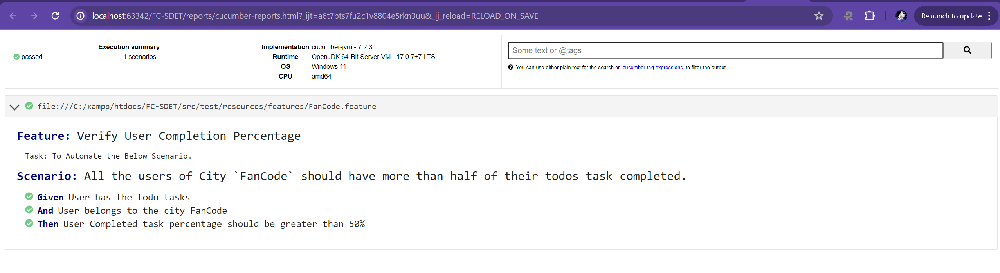
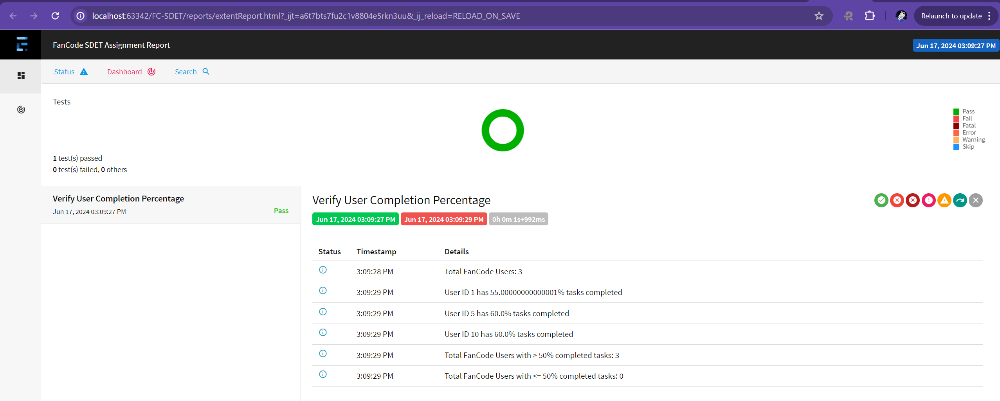

# FanCode SDET Assignment

## Overview

This project automates the scenario where all the users of the city `FanCode` should have more than half of their todos tasks completed. 
It has 2 implementations:
   - Cucumber Test : uses feature file , step definitions and runner class to run the test and reporting is done via cucumber's own report.
   - RestAssured Test : uses RestAssured and TestNg to run the test and reporting is done via Extent Reports.

## Prerequisites

1. Java Development Kit (JDK) 8 or higher
2. Maven
3. An IDE like IntelliJ IDEA, Eclipse, or Visual Studio Code (optional but recommended)

## Setup

1. **Clone the repository**
    ```bash
    git clone https://github.com/trishulmody/FC-SDET.git
    cd FC-SDET
    ```

2. **Resolve dependencies**

   Ensure your `pom.xml` has resolved all maven dependencies

3. **Run All Tests**
- `mvn test`

4. **Run Individual Test**
- Cucumber Test : `mvn test -Dtest=TestRunner`
- RestAssured Test : `mvn test -Dtest=StandaloneFCAssignment`

5. **Check Reports**
- Cucumber Report : reports/cucumber-reports.html  
  

- Extent Report : reports/extentReport.html
  
